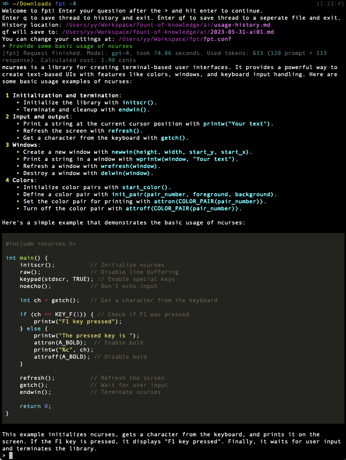

# fpt: File-based Prompt Tool with GPT-3.5/4 (CLI)

Use your own OpenAI API key or reverse endpoint to access GPT-3.5 or GPT-4 on the command line, centered around local files. Chat history will be all saved on your local machine by design, all in plain text, human-readable markdown files.


You can run `fpt` in three modes:

- **Headless**: Simply use the `fpt` command to interactively ask questions and get responses. Markdown formatting in the responses will be formatted to the console, including code blocks and tables. `q` or `qf` to save and quit.
- **Headless, single question**: e.g. `fpt -q "What is the Alcubierre drive?"`. Single question, single response, automatically saved to `./archive/usage_history.md` (configurable). Useful for saving a lot of token costs by reducing context.
- **Attached mode**: e.g. type the question you want to ask in `thread_scratchpad.md` (an empty file is provided), then `fpt -f thread_scratchpad.md`. Answers will be appended to the file, you can ask following questions by typing in the file, saving the file, and using the `f` command, or ask directly on the command line. Use the `d` or `df` command to clear the file and save the conversation to `./archive/` (configurable).

## Why?

- **Formatted Markdown on the console**: render **bold**, *italic*, `code`, lists, and tables in the replies on the console.
- **Local Chat History**: you'll own your chat history in plain text, you can search through previous conversations much faster.
- **Fast**: since fpt is a command line tool, you don't need to deal with the sluggish Web interface anymore. Say goodbye to logging in again and again on the website, waiting for the page to load, and navigating through the UI.
- **Cheap**: an average gpt-3.5 request could cost about $0.001, and you can save more by asking single questions with `fpt -q` or avoiding long threads.
- **GPT-4**: you can use GPT-4 without paying $20/month for ChatGPT Plus. An average gpt-4 request could cost about $0.015.
- **Custom Endpoints**: use your custom OpenAI endpoint. **Use custom endpoints at your own discretion.**
- **Notification**: a typical GPT-4 request could take half a minute to a minute to complete. When a request finishes, you'll get a system notification (Supported on Window, macOS, and Linux) and a notification sound. On by default.

## Quickstart

1. Clone this repository.
2. Install the required packages by running `pip install -r requirements.txt`.
3. Copy your OpenAI API key or reverse endpoint to `fpt.conf`.
4. Add the following line to your `.zshrc`, `.bashrc`, or `fish.config`:
   ```bash
   alias fpt="python3 /path/to/fpt.py"
   ```
   - Tip: you can use any name you want, e.g. "ai" by changing the alias to `alias ai="python3 /path/to/fpt.py"`. For the sake of demonstration, I use `fpt` throughout this document.
   - Tip: if you want to use `gpt-4` by default, you can change the alias to `alias fpt="python3 /path/to/fpt.py -4"`. Feel free to use shorthands such as `alias fpq="fpt -q"`.
5. Done! You can now use `fpt` on the command line. Feel free to check the two files in `./archive/` to see how a saved conversation looks like.

## How It Works

Everything is based on local files.

- **Attached Mode**: fpt will be attached to a specific file. You'll need to create a text file with a problem first, then run the program with the filename as an argument. Responses will write to the file. Then, you can choose to continue by asking another question, or use any of the commands listed below.
- You can also continue a conversation by running the program against a previously saved conversation file.
- **Headless Mode**: alternatively, you can type in a question on the command line without linking to any files, the program will write the question/response to the usage history file and write the response to stdout.

## Attached Mode

- Simple usage: `fpt -f <problem-filename>`, the file should contain a problem. No formatting is required, just type the problem in the file.
- Continuing a conversation: `fpt -f <conversation-filename>`, where the file is a previously saved conversation. The program can automatically detect if the file is a conversation or a single problem, since saved conversations contain a special 4-character horizontal divider (`----`) between each message.
  - If the conversation ends with a question, the program will respond to the question.
  - If the conversation ends with a response, the program enter attached mode (ask a question or take a command).
  - If the conversation does not meet formatting requirements, the program will give an error message and exit.
- Using GPT-4: `fpt -4 -f <problem-filename>`, where `-4` stands for force `gpt-4`. The default model is `gpt-3.5-turbo`.
- **Attached Mode Commands**:
  - Just type out your next question and hit enter to continue the conversation. If you'll need line breaks in your question, or want to type out a long question, you can type in the file using your favorite text editor instead, then use the `f` command.
  - `f`/`f3`/`f4`: force re-read the conversation from file (needs file content to meet formatting requirements) and try respond to the last question based on the conversation. You can type out your next question just below the previous response in the file, and use this command to generate the next response. `f3`/`f4` will force the program to use `gpt-3.5-turbo`/`gpt-4` to re-read the entire conversation.
  - `r`/`r3`/`r4`: regenerate the last response. `r3`/`r4` will force the program to use `gpt-3.5-turbo`/`gpt-4` to regenerate the last response.
  - `o`/`o3`/`o4`: read the file and respond to the last one question only, ignoring all previous conversation. Useful for saving huge amount of token costs, or specifically want the model to ignore all previous context if you are asking independent questions and still want them to be saved in the same thread. `o3`/`o4` will force the program to use `gpt-3.5-turbo`/`gpt-4` to respond to the last one question only.
  - `d` (dump-to-history): Clear the current file, and archive the cleared conversation to the usage history file.
  - `df` (dump-to-file): Clear the current file, and archive the cleared conversation to another file, with auto-generated filenames like `2023-01-01-ai01.md`. Useful for using a "scratchpad" file to test out ideas, and archive the content if you want to keep it. Files are saved in the archive directory.
  - `q`: quit the program.
  - `h`: show help message.

## File Format

You don't really need to worry much about the file format, but if you are curious, here's how it works:

- Messages have two types: prompts and responses.
- A conversation starts with a question, and have an alternating sequence of prompts and responses.
- All messages are separated by a 4-character horizontal divider (`----`), with an empty line above and below.
- Apart from the last question if the conversation ends with a question, all prompts are inside a markdown blockquote (`> `). This is for ease of reading and for the program to distinguish between prompts and responses. Aside from the two empty lines above and below, all lines of the question must start with `> `.
- Because of the format requirements above, a horizontal divider with four dashes and empty lines above and below cannot appear in any messages. Likewise, a response cannot be entirely within a markdown blockquote.

## Fun Facts

- I wrote this tool for myself, and I've been using it as my primary way to interact with AI chatbots for 2 months before releasing it to GitHub. A lot of changes and design choices slowly and organically took place during these two months.
- I tested it by using it. This should work on Windows, macOS, and Linux, but I've been primarily using it on macOS. Feel free to open an issue if you encounter any problems and I'll be happy to fix it!
- Why Python: Python has an officially maintained openai package that I can use. Besides, the speed of Python is good enough for this use case since the API calls are by far the slowest part of the program.

## Screenshots

Code rendering on the console:



## License

MIT
